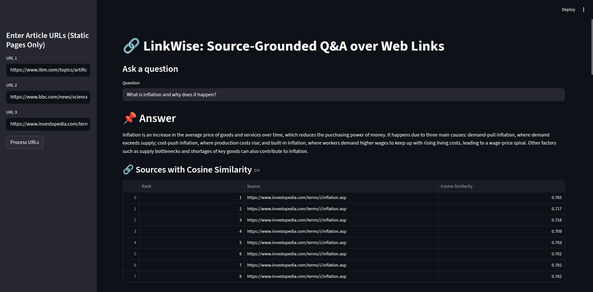

# 🔗 LinkWise  
### Source-Grounded Question Answering over Web Links

LinkWise is a **Retrieval-Augmented Generation (RAG)** system that allows users to ask questions over web articles and receive **fact-grounded, source-aware answers**.  
The system emphasizes **hallucination control, transparency, and explainability** by exposing source URLs, cosine similarity scores, and relevance visualizations.

---

## 🖼️ Application Preview

### 🔹 Document Ingestion & Indexing
The system ingests web links, splits content into semantic chunks, and builds a FAISS vector index.

---

### 🔹 Answer Generation with Cosine Similarity
Each answer is generated strictly from retrieved context and includes **ranked sources with cosine similarity scores**.

---

## 🚀 Key Features

- 🌐 Ingests multiple **web article URLs**
- ✂️ Splits documents into overlapping semantic chunks
- 🔎 Performs **semantic search using FAISS**
- 📐 Computes and displays **cosine similarity scores**
- 🤖 Generates grounded answers using **OpenAI LLMs**
- 📊 Visualizes relevance using bar charts
- 🔗 Provides ranked source attribution
- 🛑 Prevents hallucinations by answering only from context

---

## 🧠 System Architecture
User
  │
  ▼
Streamlit UI
  │
  ▼
Web Link Ingestion
  │
  ▼
Text Chunking & Embedding
  │
  ▼
FAISS Vector Store
  │
  ▼
Semantic Retrieval (Cosine Similarity)
  │
  ▼
LLM (OpenAI)
  │
  ▼
Answer + Sources + Similarity Scores

